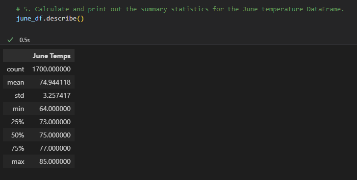
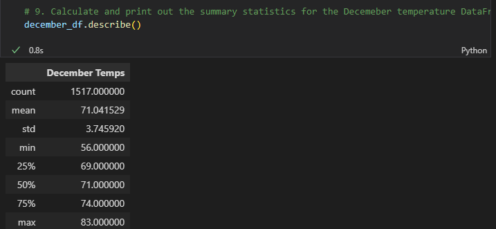
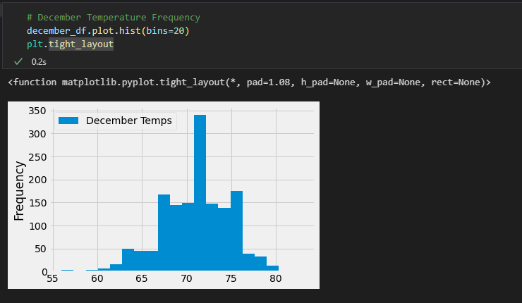
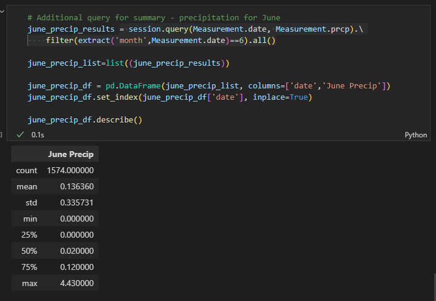
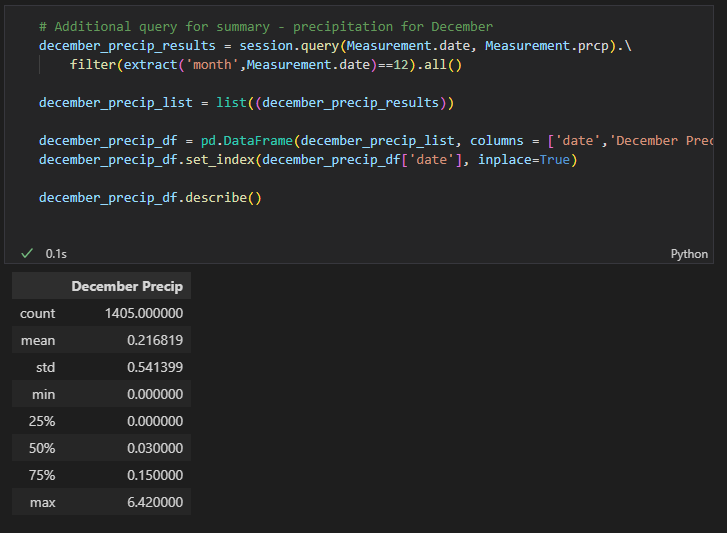

# Surfs_up
## Overview of the Statistical Analysis:
### Background:
>W. Avy likes your analysis, but he wants more information about temperature trends before opening the surf shop. Specifically, he wants temperature data for the months of June and December in Oahu, in order to determine if the surf and ice cream shop business is sustainable year-round.

### Resources:
- Data Source: 'hawaii.sqlite'
- Data Tools: 'sqlalchemy', 'numpy', 'pandas'
- Software: SQLite, Python 3.7.9, VS Code

### Deliverables:
 * Deliverable 1: Determine the Summary Statistics for June
 * Deliverable 2: Determine the Summary Statistics for December
 * Deliverable 3: A written report for the statistical analysis

## Results:
* Summary statistics of temperature in Oahu for the month of June

* Summary statistics of temperature in Oahu for the month of December

1. The mean temperature for the month of June is 74.94°F whereas the mean temperature for December is 71.04°F. The min temperatures for June is 64°F and 56°F for December. As for the Max temperatures, we see that June is at 85°F and 83°F for December. 

* June Temperature Frequency Graph

* Decemberr Temperature Frequency Graph

2. The two graphs showing the frequency of temperatures for the months of June and December gives us a better picture on the consistencies of temperatures. The June graph is showing a more symmetrical distribution of data. This means that the june temperature has less variance. As for December, the graph is showing the highest frequency to be around the 72°F-73°F temperature range. It then plateaus on either side of those range. This means that the temperatures in December is more varied. 

## Summary:

The results only give a glimpse of what the surf shop and the ice cream shop will experience in Oahu. However, we can conclude by only looking at the temperature that Oahu can be a likable location for surfers to come and enjoy the weather, the waves, and the ice creams. I concluded the analysis by retrieving the precipitation rates for the months June and December.

* Summary statistics for precipitation in Oahu for the month of June

* Summary statistics for precipitation in Oahu for the month of December

1. The mean precipitation rate for June is 0.136 with 75% of the precipitation equalling 0.12, meaning moderate rainfall

2. The mean precipitation rate for December is 0.22 with 75% of the precipitation equalling 0.15, meaning moderate rainfall. But compared to June, the rainfall rate is higher.

Both precipitation results for June and December can help in deciding whether it is profitable and sustainable to open a surf and ice cream shop in Oahu. Taking other indicators into account (ie.competitors on the island, tourism numbers, location) as well as the results in this analysis will make the decision to invest in such a project profitable and sustainable.
